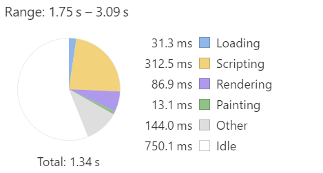

# [lifehacker](http://www.akado.ru/) 

85 requests  
2.7 MB transferred  
DomContentLoaded: 2.53  
Load: 3.72  

1. Включить gzip (сразу станет лучше) сжимается здесь тока html страница – _ожидание загрузки_

2. Картинки
  Размер: 1.3  
  Запросов: 47  

 * Использовать векторную графику вместо png для каждой иконки, либо объединить в один битмап и управлять переключением в css – _количество запросов_

3. JS

  Размер: 997 KB  
  Запросов: 20

  * Объединить – _количество запросов_
  * Минифицировать - _ожидание загрузки_
  * Я бы вынес инлайн скрипты в файл - _количество запросов_
  * Перенести вниз - _рендеринг_
  * Использовать async - _рендеринг_

4. CSS

  Размер: 265  
  Запросов: 8
  * Объединить - _количество запросов_
  * Минифицировать - _ожидание загрузки_
  * Удалить лишние правила (1125 rules (72%) of CSS not used by the current page) – _декодирование, ожидание загрузки_

5.	HTML 

  * Минифицировать - _ожидание загрузки_

6.	Битые ссылки

  * Удалить - _количество запросов_
  
  - http://www.akado.ru/js/adfox/adfox.asyn.code.ver3.js 
  - http://www.akado.ru/js/adfox/adfox.asyn.code.scroll.js 
  - http://www.akado.ru/js/adfox/adfox.asyn.code.ver3.js 
  - http://www.akado.ru/js/adfox/adfox.asyn.code.scroll.js 
  - http://www.googletagmanager.com/gtm.js?id=GTM-W8D9KM
  
7. Оптимизировать выполнения скриптов и рендеринг

      
