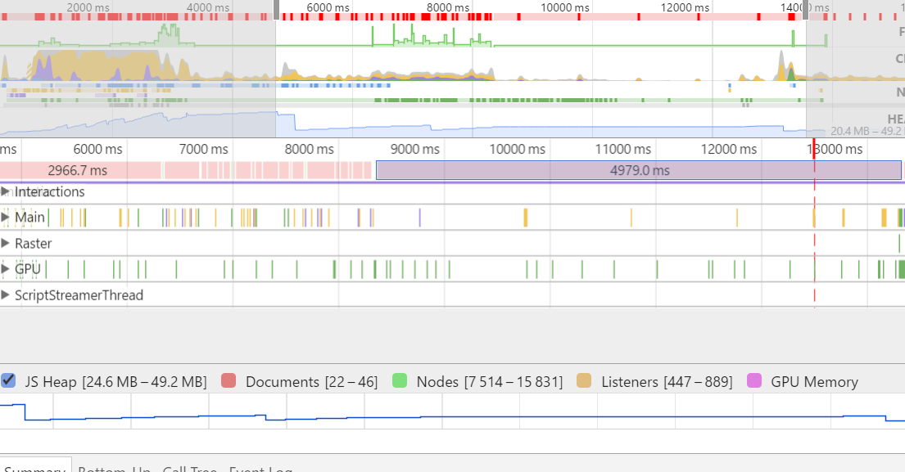
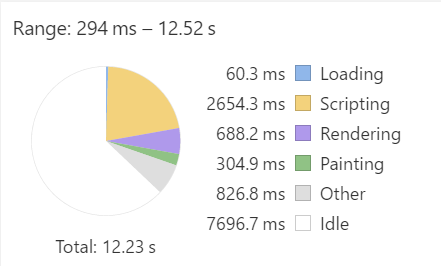
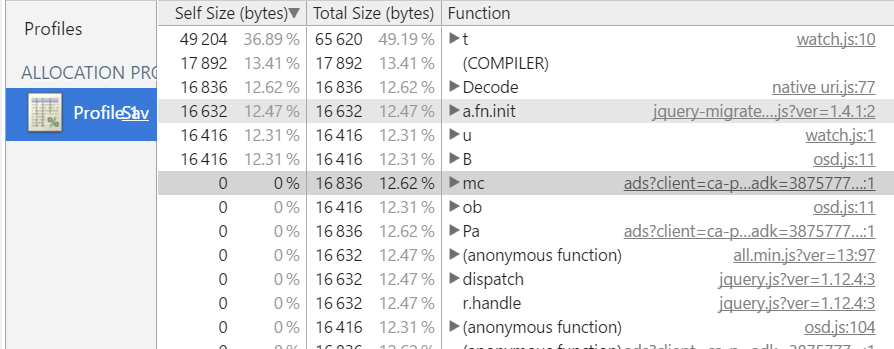
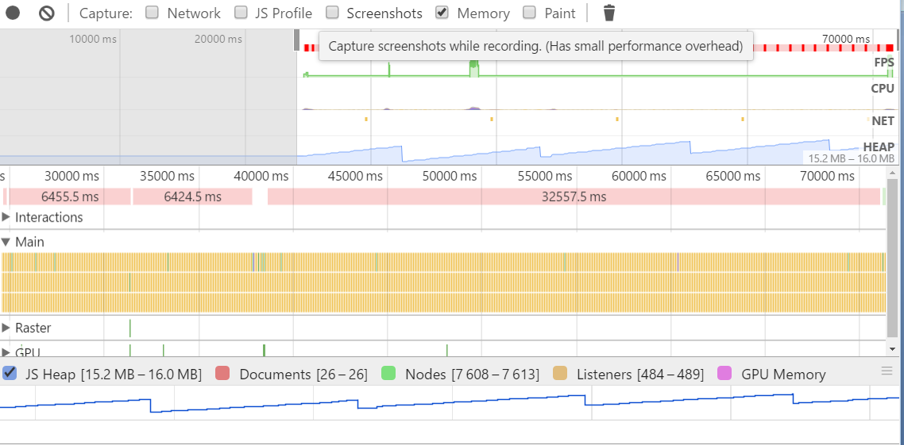

# [lifehacker](https://lifehacker.ru/) 

400 requests  
22.6 MB transferred  
DomContentLoaded: 1.43  
Load: 11.52  

Далее оптимизации буду перечислять в порядке критичности (по моему мнению)

1. Картинки

  Размер: 21.6 MB  
  Запросов: 135
  
  * Уменьшить число картинок (сделать меньше ленту, очень длинная, достаточно одного двух экранов) – _уменьшим количество запросов, ожидание ответа, время декодирования_
  * Вставлены очень жирные gif и png файлы (лучше не вставлять, а если очень нужно оптимизируем) – _ожидание ответа, декодирование
  ([пример](https://lifehacker.ru/wp-content/uploads/2016/07/moooney_1469626535-630x315.gif) например  3.8MB)_
  * Адаптивности нет, использовать разные картинки для разных размеров экранов, а еще лучше резать на сервере в зависимости от размера экрана клиентского устройства) - _ожидание ответа, декодирование_
  * Сделать из svg иконок, иконочный шрифт - _уменьшим количество запросов_
  [пример 1](https://lifehacker.ru/wp-content/themes/lifehacker/static/img/category-icons/sport.svg), [пример 2](https://lifehacker.ru/wp-content/themes/lifehacker/static/img/category-icons/food.svg)
  * Слишком большие картинки очень медленно рисуются, видно, как проседает fps на графике - _рендеринг_  
  * Запросы непонятного вида (может это маяк, старый вид опросы сервера), в общем надо разобраться и может их убрать - _уменьшим количество запросов [пример](https://sync.teads.tv/um?eid=45&uid=0a4f554edfecb137df67fc59035abebf)_
  
  > PS: сайт адаптивный, но на телефоне он у меня так и не заработал, первый раз картинки не загружались второй раз был, просто белый экран

2. CSS

  Размер 75.8 KB  
  Запросов 20
  
  * Необходимо объединить в 1 файл - _уменьшим количество запросов_
  * Минифицировать (часть не минифицирована) - _ожидание ответа_
  * Все они являются блокирующими (стоит media=all) возможно стоит разделить на два, например, файла, и часть реже используемую загружать не сразу (media=none/all) - _ожидание ответа_
  * Удалить не используемые правила (3924 rules (89%) of CSS not used by the current page.) - _ожидание ответа_

3. JS 

  Размер: 766 KB  
  Запросов: 151
  
  * Необходимо объединить - _уменьшим количество запросов_
  * Минифицировать - _ожидание ответа_
  * Все они блокирующие поэтому стоит перенести из шапки вниз (ну собственно после объединения) - _рендер_
  * Я думаю стоит поставить этому бандлу async ибо нет причин делать его здесь блокирующим, сайт просто с контентом - _рендер_

4. Шрифты

  * Здесь есть 4 файла с веб шрифтами, часть вверху и являются блокирующими, я бы все же сначала использовал обычный шрифт, потом догружал и при повторном входе использовал (но это уже дело вкуса думаю) - _ожидание ответа_

5. XHR и другие

  Запросов: около 80  
  [Пример](https://lifehacker.ru/pocket/?url=https%3A%2F%2Flifehacker.ru%2F2016%2F07%2F14%2Fpokemon-go-tips-and-tricks%2F)
  
  * Если часть не нужна - _уменьшим количество запросов_

6. Минифицировать html страницу (здесь явно можно уложиться в 14 KB, сейчас 19) - _ожидание ответа_

7. Кэшировать на более длинное время файла( касается бандлов css, js) - _уменьшим количество запросов_

  [Пример](https://lifehacker.ru/wp-content/plugins/lh-social-slider/assets/css/style.css?ver=1.10)
  - Cache-Control: max-age=86400
  - Date: Thu, 04 Aug 2016 07:26:07 GMT
  - Expires: Fri, 05 Aug 2016 07:26:07 GMT
  - Last-Modified: Fri, 29 Jul 2016 15:07:10 GMT  
  
  > Здесь видно, что последний раз изменяли 23 Июля, но кэш работает 1 день, можно ставить больше, как вариант что меняется часто выносить в отдельный файл, а остальное кэшировать на меньшее время
  
8. Оптимизации написанных стилей и скриптов – _декодирование, исполнение, вычиление_

 

  > Это более трудозатратно но видно что выполнения скриптов, рендеринг и отрисовка занимают много времени, нужно разбираться во внутреннем устройстве и что то менять
  
  - Скрипт watch.js очень много ресурсов ест
     
  - Судя по этому графику есть утечки памяти
      

  > После каждой сборки увеличивается на 100 KB количество памяти
